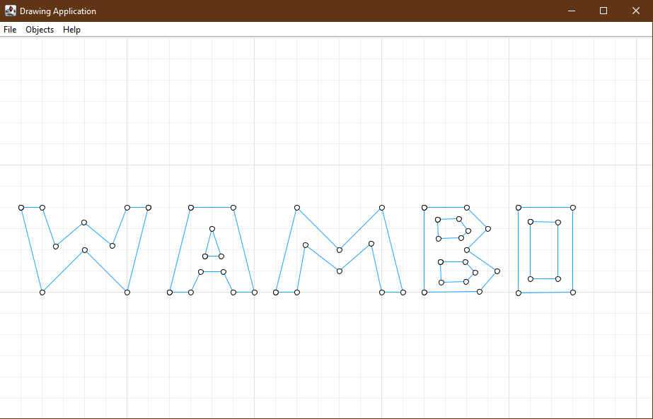
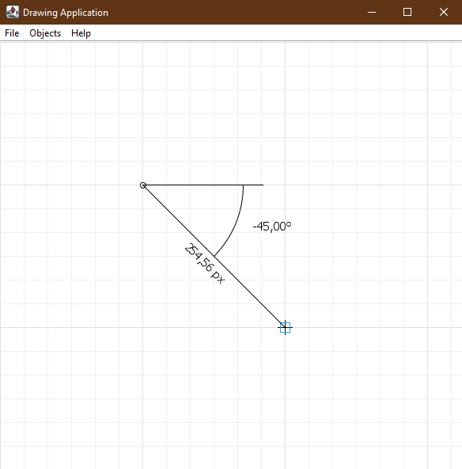
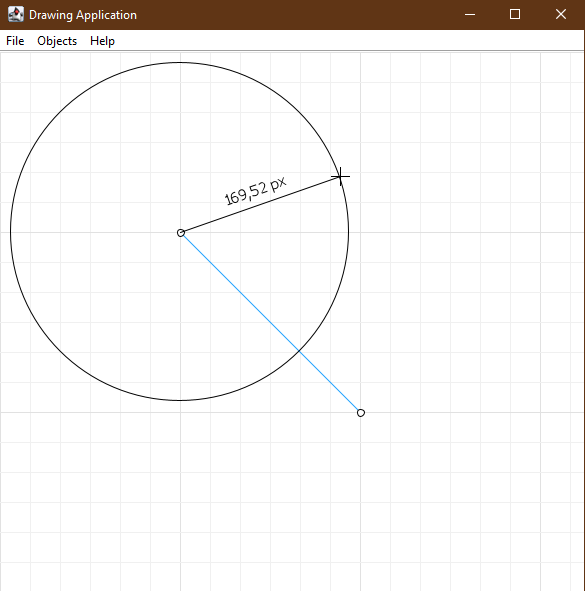

# 🖊 Fusion360-like-drawing-app
This is a very tiny app that I once made for a school assignment. 🎓

Supports drawing of Lines, Rectangles, Circles and Points. All Points snap to each other and the grid.
You can disable Point snapping in the preferences or with the corresponding keyboard shortcut.

Drawings can be stored and reopened 💾. An example is shown in drawings/WAMBO.txt

## ⌨ Shortcuts
- Keys Pressed:
  + 'l': new Line
  + 'r': new Rectangle
  + 'c': new Circle
  + 'p': new Point
  + 'Esc': Exit Edit Mode for current Object
  + 'CTRL': Points don't snap to the Grid while holding

- Mouse Clicked:
  + Left-Click to Drag and Drop Points
  + Right-Click a Point to delete it

## 🖼 Images

